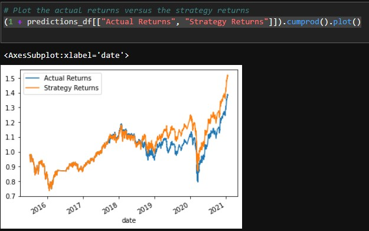

# Machine_Learning_Trading_Bot
FinTech challenge 14

##  Baseline Performance
Plotting the Actual Returns and Strategy Returns we can see that the baseline model does not do well.

## SVC Model Performance
The SVC does a lot better than the baseline model

## Tune the Baseline Trading Algorithm

What impact resulted from increasing or decreasing the training window?
SLicing the data to only use data from 2018 to 2021 resulted in a better model than the basline.

What impact resulted from increasing or decreasing either or both of the SMA windows?
 Increasing the short window from 4 to 20, there is no improvement to model
 

 Decreasing the long window from 100 to 50 does not improve the model
  

## Evaluate a New Machine Learning Classifier
 
Did this new model perform better or worse than the provided baseline model? This model did better than the provided baseline model.

Did this new model perform better or worse than your tuned trading algorithm? This model did better than the tuned trading algorithm.